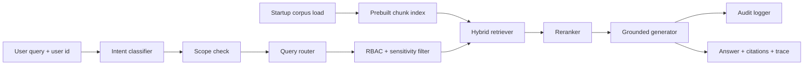

# Final Presentation Guide

## 1-Minute Opening

"This project is a secure Enterprise RAG assistant. The challenge is not just retrieving the right information from PDFs, CSV-style records, JSON logs, reports, and metadata. The harder enterprise requirement is making sure users only see information they are authorized to access.

The system takes a user identity and a natural-language query, classifies intent, routes the query to relevant source types, applies RBAC and sensitivity-level filtering, retrieves only authorized chunks from a prebuilt hybrid index, reranks the results, and generates a grounded answer with citations, confidence, latency timings, and audit traceability."

## Best Demo Flow

### Start The Web Dashboard

```powershell
python -m enterprise_rag.cli --serve --port 8080
```

Open:

```text
http://localhost:8080
```

### Demo 1: Normal Authorized Retrieval

User: **Alice Raman**  
Query:

```text
What changed in the vendor payment approval workflow?
```

What to show:

- Multi-source answer from internal finance documents and structured vendor payment records.
- Citations include `doc_id` and `block`.
- Trace shows route, RBAC, reranker, retrieval notes, and latency timings.

What to say:

"Alice is a Finance Analyst, so finance documents and vendor payment records are accessible. The answer is grounded in retrieved snippets, and every claim has source attribution."

### Demo 2: Security Log Retrieval

User: **Bob Chen**  
Query:

```text
Show security alerts for impossible travel
```

What to show:

- The system routes to JSON logs.
- It returns the `impossible_travel` event.
- The answer is narrow and does not include unrelated system-health logs.

What to say:

"This shows query-aware routing. The user asks about an impossible-travel security alert, so the system searches log events instead of every enterprise source."

### Demo 3: RBAC Block

User: **Bob Chen**  
Query:

```text
What are the payroll audit findings?
```

What to show:

- No answer is generated from the restricted HR payroll document.
- Trace shows `Payroll Audit Findings` blocked by `role_mismatch`.

What to say:

"Bob is a Security Analyst, not an HR Manager. The payroll document is blocked before generation, so the model never receives restricted HR content."

### Demo 4: Sensitivity-Level Block

User: **Alice Raman**  
Query:

```text
What did the penetration test find?
```

What to show:

- Alice is blocked from the restricted penetration test report.
- Trace shows `sensitivity_restricted`.

What to say:

"This is the second security layer. Even if a query is relevant, RESTRICTED documents require elevated roles such as Executive, Security Analyst, or Compliance Officer."

### Demo 5: Compliance Cross-Source Query

User: **Frank Novak**  
Query:

```text
What is the GDPR compliance assessment status?
```

What to show:

- Answer combines the GDPR assessment document and compliance audit log rows.
- This demonstrates cross-source retrieval.

What to say:

"Frank is a Compliance Officer, so he can access compliance documents and audit records. The system synthesizes across document and structured-record sources."

## CLI Commands

Use these if the browser is not convenient:

```powershell
python -m enterprise_rag.cli --user alice --query "What changed in the vendor payment approval workflow?"
python -m enterprise_rag.cli --user bob --query "Show security alerts for impossible travel"
python -m enterprise_rag.cli --user bob --query "What are the payroll audit findings?"
python -m enterprise_rag.cli --user alice --query "What did the penetration test find?"
python -m enterprise_rag.cli --user frank --query "What is the GDPR compliance assessment status?"
```

Out-of-scope short-circuit demo:

```powershell
python -m enterprise_rag.cli --user alice --query "What is the weather today?"
```

## Architecture Walkthrough



Key architecture points:

- The corpus is loaded and indexed once at startup.
- Runtime queries do not rebuild the index.
- RBAC produces authorized document IDs.
- Retrieval uses those IDs as a metadata filter.
- Reranking improves result ordering before generation.
- The generator only uses retrieved, authorized snippets.
- Every response includes citations, confidence, trace, and timings.

## File-By-File Code Walkthrough

### 1. `enterprise_rag/cli.py`

Entry point for both CLI and web mode.

Say:

"This is where the system receives user identity and query together. Identity is not optional in enterprise RAG because access control depends on it."

### 2. `enterprise_rag/pipeline.py`

Main graph-based orchestration.

Flow:

1. Classify intent.
2. Check out-of-scope queries.
3. Route query.
4. Apply RBAC and sensitivity filtering.
5. Retrieve from prebuilt index.
6. Rerank.
7. Generate grounded answer.
8. Audit.

Say:

"This is the core pipeline. The important design decision is that security filtering happens before retrieval results reach generation."

### 3. `enterprise_rag/graph.py`

Lightweight pipeline graph engine.

Say:

"Instead of a loose sequence of functions, the system uses graph-style pipeline nodes. This makes the flow easier to extend with conditional paths like short-circuiting or future self-RAG loops."

### 4. `enterprise_rag/loaders.py`

Loads heterogeneous enterprise data.

Sources:

- internal text documents
- CSV rows
- JSONL log events
- access policies
- user-role mappings

Say:

"Everything becomes a shared `Document` model with source type, sensitivity level, allowed roles, metadata, and text."

### 5. `enterprise_rag/intent.py`

Classifies the query as:

- factual
- comparison
- aggregation
- temporal
- exploratory

Say:

"Intent classification is used for traceability and can support future routing or response-style decisions."

### 6. `enterprise_rag/router.py`

Routes queries to source types.

Say:

"Routing narrows the search space. Security alerts go to logs; vendor payment questions go to finance docs and structured records; access questions go to policy metadata."

### 7. `enterprise_rag/security.py`

Enforces:

- role-based access control
- sensitivity-level gating
- Executive superuser behavior

Say:

"The security layer returns accessible documents and blocked documents. Blocked documents are visible only as trace metadata, never as answer context."

### 8. `enterprise_rag/retrieval.py`

Prebuilt hybrid retrieval index.

Signals:

- BM25 keyword score
- TF-IDF score
- synonym expansion
- metadata tag boost
- source-aware overlap threshold
- chunk deduplication

Say:

"The index is built once. At query time, retrieval receives authorized document IDs, so unauthorized chunks are physically skipped during search."

### 9. `enterprise_rag/reranker.py`

Reranks search hits.

Signals:

- query coverage
- source diversity
- original retrieval position

Say:

"The retriever gets candidates quickly; the reranker improves ordering so the best evidence appears first."

### 10. `enterprise_rag/generator.py`

Grounded answer generation.

Say:

"This is intentionally extractive and offline. It refuses to answer when accessible evidence is missing, which reduces hallucination and prevents data leakage."

### 11. `enterprise_rag/audit.py`

Append-only audit log.

Say:

"Each query records user ID, query, routed sources, accessible count, blocked count, confidence, and sensitivity levels accessed."

### 12. `enterprise_rag/evaluate.py`

Offline evaluation harness.

Say:

"We evaluate retrieval quality and security with MRR, Precision@3, Recall@3, NDCG, and RBAC pass rate."

### 13. `enterprise_rag/web/server.py`

REST API and static dashboard server.

Endpoints:

- `GET /api/health`
- `GET /api/users`
- `POST /api/query`

Say:

"The API layer validates requests, rejects unknown users, and exposes the same secured pipeline to the dashboard."

## Evaluation Results

Run:

```powershell
python -m enterprise_rag.evaluate
```

Current results:

| Metric | Score | What It Means |
| --- | ---: | --- |
| MRR | 1.000 | Expected source appears at rank 1 across evaluation cases |
| Precision@3 | 0.792 | Most top-3 retrieved sources are relevant |
| Recall@3 | 1.000 | All expected sources are recovered in top 3 |
| NDCG | 1.000 | Relevant sources are ranked in ideal order |
| RBAC pass rate | 100.0% | No restricted expected-blocked source leaked |

How to explain Precision@3:

"Precision@3 is below 1.0 because the system sometimes returns supporting enterprise sources in addition to the primary expected source. That is acceptable for multi-source RAG, and we still recover all expected sources with perfect Recall@3 and NDCG."

## Test Command

```powershell
python -m unittest discover -s tests -v
```

Expected:

```text
Ran 62 tests
OK
```

Coverage areas:

- evaluation metrics
- graph execution
- intent classification
- pipeline behavior
- reranking
- retrieval
- routing
- security
- web API

## Requirements Mapping

| Challenge Requirement | Implementation |
| --- | --- |
| Multi-format data | `data/`, `loaders.py` |
| Intelligent retrieval | `retrieval.py`, `reranker.py` |
| Query-aware routing | `router.py`, `intent.py` |
| Cross-source context | multi-source answers in `generator.py` |
| RBAC enforcement | `security.py` |
| Restricted document access | sensitivity levels in `access_policies.json` |
| Safe sensitive queries | no-evidence refusal and blocked trace |
| Grounded responses | extractive generator with citations |
| Source attribution | `doc_id`, `block`, file path citations |
| Explainability | `QueryTrace`, timings, trace panel |
| Auditability | `audit.py`, `query_audit.jsonl` |
| Web interface | `enterprise_rag/web/` |

## Likely Questions And Answers

### Why not use an external LLM?

"For the challenge demo, I kept generation local and extractive so the security behavior is deterministic. In production, an LLM could be added after the same RBAC-filtered retrieval layer."

### Why not use a vector database?

"The architecture is ready for it: the current prebuilt in-memory index can be replaced by Qdrant, Pinecone, Milvus, or pgvector. The same metadata filtering idea would apply."

### How do you prevent unauthorized exposure?

"Unauthorized documents are filtered before retrieval results reach generation. The generator never receives restricted text, so it cannot summarize or leak it."

### What happens if the query is unrelated?

"The scope check short-circuits non-enterprise questions before retrieval and returns a safe response."

### Is the system production-ready?

"It is production-style and demonstrates the core architecture: RBAC, sensitivity, routing, hybrid retrieval, reranking, citations, audit logs, evaluation, and web API. For real production, I would add external authentication, a persistent vector database, observability, and a hardened deployment stack."

## Closing Line

"The system demonstrates the enterprise RAG contract: retrieve the right context, only after authorization, then answer with citations, confidence, latency trace, and auditability. The result is accurate, explainable, and safe for sensitive enterprise data."

