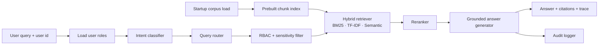

# Enterprise RAG Intelligence Challenge

[GitHub Repository](https://github.com/JoshDilipkumarPatel/Enterprise-RAG-Intelligence-Challenge)

This repository implements a production-grade secure enterprise Retrieval-Augmented Generation system. It retrieves from disconnected enterprise data sources while enforcing role-based access control and sensitivity-level gating before anything reaches answer generation.

## What This Shows

- **Multi-format ingestion**: internal documents, CSV/SQL-style exports, JSON audit logs, system health events, metadata, and access policies
- **Query-aware routing**: narrows search to likely source types before retrieval
- **Intent classification**: labels queries as factual, comparison, aggregation, temporal, or exploratory
- **Out-of-scope short-circuiting**: non-enterprise questions are rejected before retrieval
- **Prebuilt retrieval index**: documents are chunked and indexed once at startup, not rebuilt per query
- **Metadata-filtered hybrid retrieval**: combines BM25, TF-IDF, and synonym-aware semantic expansion while filtering by authorized document IDs
- **Reranking**: reorders retrieved hits using coverage, position, and source-diversity signals
- **Strict RBAC**: filters documents by user role and sensitivity level before answer generation
- **Multi-source synthesis**: answers that span multiple source types are grouped by category with source-type icons
- **Grounded answer generation**: answers only from retrieved snippets and includes document/block citations
- **Explainability**: returns route decisions, blocked documents, sensitivity filters, confidence scores, source traces, and latency timings
- **Audit logging**: every query is recorded in an append-only audit trail
- **Evaluation harness**: MRR, precision@3, recall@3, NDCG, and RBAC pass-rate checks
- **Web dashboard**: premium dark-mode glassmorphism UI with interactive query builder

## Run The Demo

### Web Dashboard

```powershell
python -m enterprise_rag.cli --serve --port 8080
```

Then open [http://localhost:8080](http://localhost:8080) in your browser.

### CLI Queries

```powershell
python -m enterprise_rag.cli --user alice --query "What changed in the vendor payment approval workflow?"
python -m enterprise_rag.cli --user bob --query "Show security alerts for impossible travel"
python -m enterprise_rag.cli --user carol --query "What are the payroll audit findings?"
python -m enterprise_rag.cli --user frank --query "What is the GDPR compliance assessment status?"
python -m enterprise_rag.cli --user grace --query "Summarize active vendor contracts and SLAs"
```

## Demo Users

| User | Role | Example Access |
| --- | --- | --- |
| `alice` | Finance Analyst, Budget Reviewer | finance docs, vendor payments, quarterly reports |
| `bob` | Security Analyst | security logs, penetration test reports, audit events |
| `carol` | HR Manager | HR policies, payroll audit, employee directory |
| `dave` | Operations Manager | operations reports, IT infrastructure, system health |
| `erin` | Executive | all enterprise summaries (superuser) |
| `frank` | Compliance Officer | GDPR assessment, compliance audit logs, access trails |
| `grace` | Legal Counsel | vendor contracts, GDPR assessment |

## Enterprise Data Corpus

| Category | Files | Count |
| --- | --- | --- |
| 📄 Internal Documents | vendor workflow, payroll audit, operations report, GDPR assessment, IT review, HR benefits, finance Q2 report, legal contracts, penetration test report | 9 |
| 📊 Structured Records | vendor payments, customer tickets, employee directory, compliance audit log, IT asset inventory | 5 CSVs (53 rows) |
| 📋 Log Events | security events, access audit trail, system health events | 3 JSONLs (21 events) |
| 🔒 Policies & Metadata | access policies, user roles | 2 JSONs |

## Architecture



## Code Walkthrough For Presentation

1. Start at [enterprise_rag/cli.py](enterprise_rag/cli.py): shows how a user and natural-language query enter the system.
2. Move to [enterprise_rag/pipeline.py](enterprise_rag/pipeline.py): the graph-based RAG flow is wired together here.
3. Show [enterprise_rag/loaders.py](enterprise_rag/loaders.py): loads heterogeneous enterprise sources into one document model with sensitivity levels.
4. Show [enterprise_rag/intent.py](enterprise_rag/intent.py): classifies the user's intent for traceability.
5. Show [enterprise_rag/router.py](enterprise_rag/router.py): routes the query to likely source types.
6. Show [enterprise_rag/security.py](enterprise_rag/security.py): enforces RBAC and sensitivity-level gating before retrieval results reach generation.
7. Show [enterprise_rag/retrieval.py](enterprise_rag/retrieval.py): searches the prebuilt index with hybrid scoring and metadata filters.
8. Show [enterprise_rag/reranker.py](enterprise_rag/reranker.py): reranks candidate hits before generation.
9. Show [enterprise_rag/generator.py](enterprise_rag/generator.py): creates a grounded response with multi-source synthesis and confidence calibration.
10. Show [enterprise_rag/audit.py](enterprise_rag/audit.py): append-only audit trail for every query.
11. Show [enterprise_rag/evaluate.py](enterprise_rag/evaluate.py): offline quality and RBAC evaluation.
12. Show [enterprise_rag/web/server.py](enterprise_rag/web/server.py): REST API and web dashboard server.

## Why RBAC Happens Before Generation

The key security decision is in [enterprise_rag/security.py](enterprise_rag/security.py): inaccessible documents are removed before they can become context. That means the answer generator never sees restricted content, which prevents accidental leakage through summarization.

## Sensitivity Levels

| Level | Who Can Access |
| --- | --- |
| `public` | All users |
| `internal` | Users with matching role |
| `confidential` | Users with matching role |
| `restricted` | Executive, Security Analyst, or Compliance Officer only |

## Tests

```powershell
python -m unittest discover -s tests -v
```

62 tests across evaluation, graph flow, intent, pipeline, reranking, security, retrieval, routing, and web API behavior.

Optional evaluation run:

```powershell
python -m enterprise_rag.evaluate
```

Current local evaluation:

| Metric | Score |
| --- | ---: |
| MRR | 1.000 |
| Precision@3 | 0.792 |
| Recall@3 | 1.000 |
| NDCG | 1.000 |
| RBAC pass rate | 100.0% |
