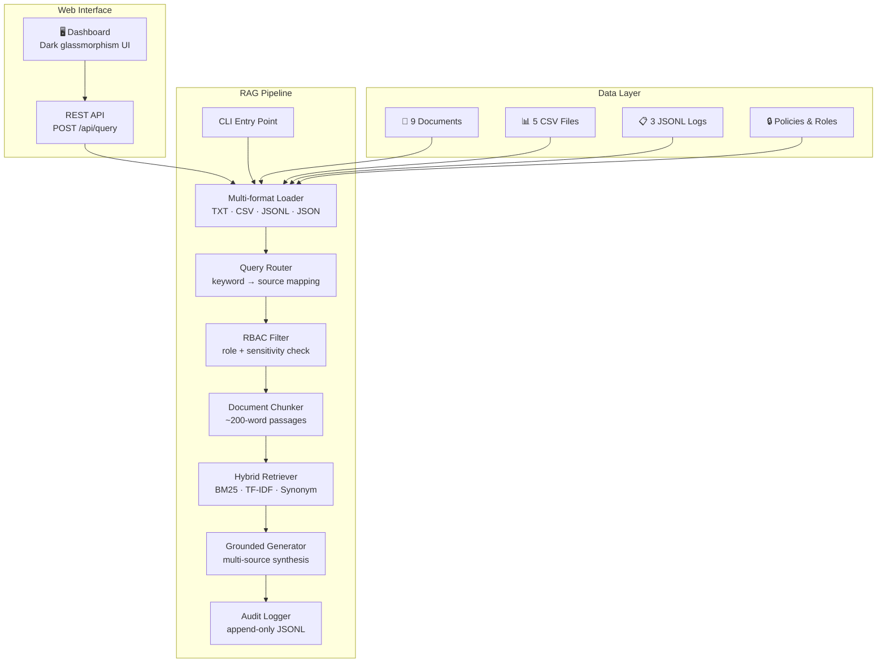

# Enterprise RAG Intelligence System — Production Upgrade

Upgrade the existing presentation-ready prototype into a production-grade Enterprise RAG system with a stunning web interface, richer enterprise datasets, stronger security enforcement, and enhanced retrieval/generation capabilities.

## Current State Assessment

The existing codebase is a solid CLI-only prototype with:
- **3** text documents, **2** CSVs, **1** JSONL log, **2** metadata files
- **5** users across 5 roles (Finance, Security, HR, Operations, Executive)
- BM25 + synonym-expansion hybrid retrieval
- Extractive grounded generation (snippet assembly, no LLM)
- Basic RBAC: role-intersection check before generation
- CLI-only interface

### Strengths to Preserve
- Clean architecture: loaders → router → security → retrieval → generator
- Frozen dataclasses for immutability
- RBAC filtering happens *before* generation (security-by-design)
- Existing tests pass (3/3)

### Gaps to Address
- Tiny dataset — only 3 documents, 6 CSV rows, 3 log events
- No web interface
- No sensitivity-level classification on documents
- No audit trail of queries and access decisions
- No chunk-level indexing (whole documents are indexed)
- Single-pass extractive generation only
- No confidence calibration beyond a simple heuristic
- No cross-source synthesis (answer assembles snippets, doesn't reason across them)

---

## Proposed Changes

### 1. Expanded Synthetic Enterprise Dataset

Create a realistic, multi-department enterprise data corpus spanning 6 silos.

#### [NEW] `data/documents/` — 6 additional text documents

| File | Department | Content |
|---|---|---|
| `compliance_gdpr_assessment.txt` | Compliance | GDPR readiness assessment with gaps and remediation timeline |
| `it_infrastructure_review.txt` | Operations/IT | Cloud migration status, server inventory, uptime metrics |
| `hr_benefits_policy_2026.txt` | HR | Employee benefits policy for FY2026 |
| `finance_quarterly_report_q2.txt` | Finance | Q2 revenue, expense summary, and forecast |
| `legal_vendor_contract_summary.txt` | Legal | Summary of active vendor contracts, renewal dates, SLA terms |
| `security_penetration_test_report.txt` | Security | Penetration test findings and severity classification |

#### [NEW] `data/structured/` — 3 additional CSV files

| File | Content |
|---|---|
| `employee_directory.csv` | Employee IDs, departments, hire dates, status (15 rows) |
| `compliance_audit_log.csv` | Compliance check results: control ID, status, finding, date (10 rows) |
| `it_asset_inventory.csv` | Hardware/software asset tracking: asset ID, type, owner, status (12 rows) |

#### [NEW] `data/logs/` — 2 additional JSONL log files

| File | Content |
|---|---|
| `access_audit_trail.jsonl` | Document access events: who accessed what, when, decision (grant/deny) (10 events) |
| `system_health_events.jsonl` | Infrastructure monitoring: CPU/memory alerts, service restarts, error spikes (8 events) |

#### [MODIFY] `data/metadata/access_policies.json`
- Add policies for all new resources with fine-grained role assignments
- Add `sensitivity_level` field to each resource: `public`, `internal`, `confidential`, `restricted`

#### [MODIFY] `data/metadata/user_roles.json`
- Add `frank` (Compliance Officer) and `grace` (Legal Counsel) users
- Add secondary roles: alice gets `Finance Analyst` + `Budget Reviewer`
- This enables testing cross-department access scenarios

---

### 2. Web Dashboard (Premium Dark-Mode UI)

Build a stunning single-page web application served by a Python HTTP backend. No npm/node required — pure HTML + CSS + vanilla JS served from the Python process.

#### [NEW] `enterprise_rag/web/server.py`
- Flask-like lightweight HTTP server using Python's `http.server`
- REST API endpoints:
  - `POST /api/query` — accepts `{user_id, query}`, returns `RagAnswer` as JSON
  - `GET /api/users` — returns user list for the login selector
  - `GET /api/health` — system health check
- Serves static files from `enterprise_rag/web/static/`
- Serialization helpers for frozen dataclasses → JSON

#### [NEW] `enterprise_rag/web/static/index.html`
- Premium dark-mode design with glassmorphism cards
- User selector (simulated login), query input, response display
- Animated confidence meter and source badges
- Collapsible trace panel showing routing decisions, blocked documents, retrieval notes
- Citation cards with source-type icons (📄 Doc, 📊 CSV, 📋 Log, 🔒 Policy)
- Responsive layout

#### [NEW] `enterprise_rag/web/static/style.css`
- Design system: CSS custom properties for colors, spacing, typography
- Dark glassmorphism theme with subtle gradients
- Micro-animations: card entrance, confidence bar fill, shimmer loading
- Google Fonts: Inter for body, JetBrains Mono for trace data

#### [NEW] `enterprise_rag/web/static/app.js`
- Fetch-based API client
- Dynamic DOM rendering for results, citations, trace
- Loading state with skeleton shimmer
- Error handling with contextual messages
- Keyboard shortcut (Enter to query)

---

### 3. Enhanced Retrieval Pipeline

#### [MODIFY] `enterprise_rag/retrieval.py`
- Add document chunking: split long documents into ~200-word passages before indexing
- Add TF-IDF vectorization as a third scoring signal alongside BM25 and synonym expansion
- Improve score combination with learned weights (keyword: 0.5, semantic: 0.3, TF-IDF: 0.15, tag: 0.05)
- Add result deduplication when multiple chunks from the same document score highly

#### [MODIFY] `enterprise_rag/text_utils.py`
- Add `chunk_text()` function: splits text into overlapping windows
- Expand synonym dictionary with compliance, legal, and IT terms
- Add stemming improvements for more terms

#### [MODIFY] `enterprise_rag/router.py`
- Expand keyword routing with compliance, legal, IT, and HR domain terms
- Add confidence-based routing: if multiple routes match strongly, include all
- Add `SourceType.COMPLIANCE` enum for audit/compliance-specific routing

---

### 4. Strengthened Security & RBAC

#### [MODIFY] `enterprise_rag/models.py`
- Add `SensitivityLevel` enum: `PUBLIC`, `INTERNAL`, `CONFIDENTIAL`, `RESTRICTED`
- Add `sensitivity_level` field to `Document`
- Add `AuditEntry` dataclass: timestamp, user_id, query, decision, accessed_docs, blocked_docs
- Extend `QueryTrace` with `sensitivity_filter_applied` field

#### [MODIFY] `enterprise_rag/security.py`
- Implement sensitivity-level gate: users without `Executive`, `Security Analyst`, or `Compliance Officer` role cannot access `RESTRICTED` documents
- Add role hierarchy: `Executive` supersedes all roles
- Log every access decision as an `AuditEntry`

#### [NEW] `enterprise_rag/audit.py`
- Append-only audit log writer (JSON Lines to `data/logs/query_audit.jsonl`)
- Thread-safe file appending
- Stores: timestamp, user_id, query, routed_sources, accessible_count, blocked_count, answer_confidence

---

### 5. Improved Answer Generation

#### [MODIFY] `enterprise_rag/generator.py`
- Multi-source synthesis: when hits span multiple source types, generate a structured answer with sections per source type
- Better confidence calibration: factor in source diversity, hit count, score distribution, and sensitivity coverage
- Add "insufficient evidence" gradation: distinguish "no results" from "low-confidence partial results"
- Add `answer_strategy` field to output: `"single_source"`, `"multi_source"`, or `"no_evidence"`

---

### 6. Updated CLI

#### [MODIFY] `enterprise_rag/cli.py`
- Add `--serve` flag to launch the web dashboard
- Add `--port` option (default 8080)
- Keep existing CLI query mode as the default

---

### 7. Comprehensive Tests

#### [MODIFY] `tests/test_pipeline.py`
- Add tests for new users (frank, grace)
- Add sensitivity-level filtering tests
- Add cross-department access scenarios

#### [NEW] `tests/test_security.py`
- Unit tests for RBAC filter with sensitivity levels
- Test Executive bypass
- Test Compliance Officer restricted-doc access

#### [NEW] `tests/test_retrieval.py`
- Unit tests for chunking, TF-IDF scoring, deduplication
- Test that expanded dataset returns relevant results

#### [NEW] `tests/test_router.py`
- Test routing for compliance, legal, and IT queries
- Test multi-source routing

#### [NEW] `tests/test_web.py`
- API endpoint tests for `/api/query`, `/api/users`, `/api/health`
- Test RBAC enforcement through the API layer

---

## Open Questions

> [!IMPORTANT]
> **LLM Integration**: The current generator is extractive (no LLM). Should I keep it fully local/offline with extractive generation, or would you like me to add an optional LLM integration (e.g., via an OpenAI/Gemini API key) for more natural responses? The plan above keeps it fully offline by default.

> [!IMPORTANT]  
> **PDF Support**: The challenge mentions PDFs. Should I add actual PDF parsing (requires `PyPDF2` or `pdfminer` dependency), or is the `.txt` document approach sufficient since this is a synthetic dataset?

---

## Architecture After Upgrade



## Verification Plan

### Automated Tests
```powershell
python -m unittest discover -s tests -v
```
All existing tests must continue to pass. New tests cover:
- Sensitivity-level RBAC filtering
- New user roles (frank, grace)
- Chunking correctness
- Router coverage for new domains
- Web API responses

### Manual Verification
```powershell
# CLI demo — existing scenarios still work
python -m enterprise_rag.cli --user alice --query "What changed in the vendor payment approval workflow?"
python -m enterprise_rag.cli --user bob --query "Show security alerts for impossible travel"

# CLI demo — new scenarios
python -m enterprise_rag.cli --user frank --query "What is the GDPR compliance assessment status?"
python -m enterprise_rag.cli --user bob --query "What are the payroll audit findings?"

# Web dashboard
python -m enterprise_rag.cli --serve --port 8080
```
Then open `http://localhost:8080` in the browser to verify the web UI interactively.
